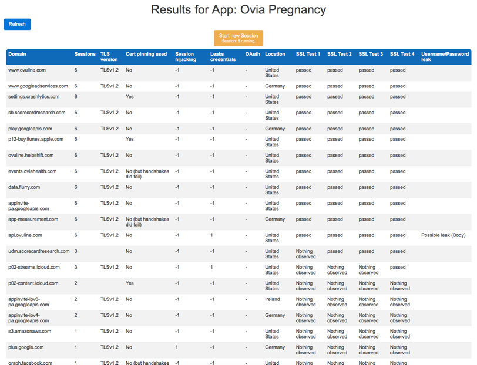

# BProxy 
###### _Client-focused transport security testing proxy_

<p align="center">

</p>

__BProxy__ is based on the [OWASP Zed Attack Proxy Project](https://www.owasp.org/index.php/ZAP). This project is part of a scientific article published in the [JMIR mHealth and u Health journal](https://mhealth.jmir.org):

__[Client-Focused Security Assessment of mHealth Apps and Recommended Practices to Prevent or Mitigate Transport Security Issues](https://mhealth.jmir.org/2017/10/e147)__


BProxy was developed to facilitate semi-automatic, client-focused transport security testing for mobile application and was used to test a number of Android and iOS mHealth applications. The proxy inspects all HTTP and HTTPS traffic and reports problematic findings to the user.

If there is interest, the project could be cleaned up and the deep integration into the ZAP proxy could be reduced.

## Introduction

BProxy is a web based HTTP/S proxy made to capture and analyse traffic from mobile applications in regards to security concerns. Security is relevant for all kinds applications. While this software was developed with native mobile applications in mind, it can be used to analyse all kinds of client applications.
The project was developed to be able to manage multiple test session independently from each other. These tests should be so easy to perform that even amateurs should be able to do them. On the other hand, it was also regarded important to give more demanding users the ability to do further research/analysis and to double check results from the BProxy system. 
With these objectives in mind BProxy was developed.


## Architectural overview

The application is based on the Zed Attack proxy and was started as a fork of version 2.4.3. The main point of reusing the existing code was the proxying, inspection and dynamic certificate issuing codebase. Changes were made to dynamically change how certificates for requested domains are issued (to enable the TLS testing scenarios discussed earlier). A representational state transfer (REST) application programming interface (API) was engineered to expose automatic creation and control of proxies [35]. Additionally, a HTTP server exposes the Angular2 based user interface. This Web-Application interacts with the REST interface to control the proxy.
The architecture of BProxy was engineered with extensibility in mind. Each single transport security consideration is tested for by a separated module. Modules can implement interfaces to register for call-backs and influence properties of TLS handshakes (for the TLS certificate validation tests). An analyser module inspects each request going through the proxy and generate a result on a per domain basis. The Username/Password Analyser for example is based around a regular expression that detect username and passwords within request URLs or bodies. The following example highlights the detected sections of a request:

```
HTTP POST http://example.org/login
Body: username=alice&password=bob
```

The analyser persists the results saying that connections to example.org do contain usernames and/or passwords. Additionally, each request leading to a result in the final report is tagged by the analyser as interesting. This enables later checking of the test results displayed by BProxy.

During each test of an application, the proxy works in sessions. Before the start of each session, the app should be relaunched. During a session, the user should interact with the app. Any registration/login actions should also be repeated if possible.
This firstly enables the system to separate domains used by the application from other domains the device might communicate with (background tasks, changing ads displayed in the app). A domain present in more sessions is more likely to be connected to the application under testing. Secondly some sessions are used for the TLS tests. This is where the session driver modules are responsible to set up test conditions. Before each session the session drivers are asked to configure the proxy and prepare it for tests conducted in the following session. To prepare the proxy for each of the TLS certificate validation tests, a session driver sets up the proxy with a special certificate service. Certificate services are responsible for the generation of certificates for each of the domains requested. The default certificate service issues certificates derived from the CA certificate that can be downloaded from the BProxy test page and should be installed on a device used for testing. Other certificate services issue invalid certificates that should not pass validation (but do in some cases). The following Figure 1 illustrates the software architecture described.  


After the necessary number of sessions, a list of domains will be displayed. The results are displayed on a per domain that the application communicated with. The modules mentioned earlier are responsible for generating these results. Were possible a user can also display all request-response pairs that are responsible for a certain result displayed in the list. This enables validation of the automatically generated results and further in-depth analysis. The package structure of the java project can be observed here:


These are the packages added to the ZAP – Attack Proxy codebase. This codebase has been modified in parts to allow for further traffic observation (information regarding failing TLS handshakes) and enhanced control (improved and exchangeable certificate services).

## Installation

The main BProxy project is set up as a Maven project. During development, the IDE Eclipse Neon was used. As a maven project, all dependencies are specified in a special file and will be installed by the build tool.

Before running the project a Mongo database should be started. BProxy is setup to expects a database running on localhost:27018 and a collection called bproxy to be present.
Running the Main.java file in Eclipse starts up the webserver and the proxy. By default, BProxy is reachable on port 8181. All addresses and ports can of course be changed to be accurate for the running environment.

The frontend Angular2 based web application is served statically by a simple HTTP server. It is setup as an npm project. Should changes be necessary the npm install command can be used to reinstall all its dependencies. Respectively npm start compiles all typescript source files and starts a webserver serving only the web application.

## Usage

As an objective during the development of BProxy was ease of use, the web interface guides the user through the process. Each test should consist of at least 6 sessions. The first two will filter out any background noise (any connections that just happen during the test in the background). The next 4 sessions will facilitate the TLS certificate validation tests.
The results are presented as a table and on a per domain basis. Currently implemented modules enable the proxy to display the following columns:

* Domain
* Sessions
* TLS version
* Certificate pinning
* Location (Geolocation of the domain requested)
* Username and/or password leaks
* Session hijacking (cookie headers)
* Leaked credentials (authorization header)
* OAuth (authorization header contents)
* TLS certificate Tests 1 - 4

Many test results can be selected to display all request/response pairs that lead to the result selected. A click on the domain itself fetches all request/response pairs exchanged with the selected domain. This is useful to look for information beyond what the reports explicitly states. Each request/response pair can also be selected for further inspecting (available information includes: TLS version, request URL, method, status code, request/response headers, request/response body).



## Evaluation

Some of the column's values are not interpretable without further information. In the following possible values will be explained.

### Session hijacking

__Possible Values:__


| Value  | Description |
| ------------- | ------------- |
| -1 | Cookie/Token not observed  |
| 0 | Secure connection used and certificate-pinning used |
| 1 | Secure connection used  |
| 2 | Cookie or token is first transmitted using a secure connection, but later sent through unsecured connections.  |
| 3 | Cookie/Token used on unprotected connections. Session hijacking easily possible. |

### TLS certificate Tests

The last four sessions in a test run are used for the certificate tests. During these, HTTPS certificates are spoofed in a way that should not be accepted by a client. If a client still validates such a certificate as correct and communicates through HTTPS connections, the client fails the respective certificate validation test.

__The tests are performed in the following order:__

| Session No.  | Description of issued certificate |
| ------------- | ------------- |
| 3 | correct host name, signed by an untrusted CA  |
| 4 | correct host name, plain self signed certificate |
| 5 | incorrect host name, trusted CA certificate  |
| 6 | incorrect host name, plain self signed certificate  |

## Credits:

* J. Müthing, BSc, from the Dortmund University of Applied Sciences and Arts, Dortmund, Germany, designed and developed this software and is a co-author of the article.
* T. Jäschke, Ph.D., from the FOM University of Applied Sciences, Essen, Germany & Dortmund University of Applied Sciences and Arts, Dortmund, Germany, contributed to the design of the tests and is a one of the authors of the article.
* C. M. Friedrich, Ph.D., from the Dortmund University of Applied Sciences and Arts, Dortmund, Germany, contributed to the design of the tests and is a one of the authors of the article.

## Cite as

```
Müthing J, Jäschke T, Friedrich CM
Client-Focused Security Assessment of mHealth Apps and Recommended Practices to Prevent or Mitigate Transport Security Issues
JMIR Mhealth Uhealth 2017;5(10):e147
URL: https://mhealth.jmir.org/2017/10/e147
DOI: 10.2196/mhealth.7791
PMID: 29046271
PMCID: 5666225
```

## License:

Copyright 2017 Jannis Müthing

Licensed under the Apache License, Version 2.0 (the "License");
you may not use this file except in compliance with the License.
You may obtain a copy of the License at

    http://www.apache.org/licenses/LICENSE-2.0

Unless required by applicable law or agreed to in writing, software
distributed under the License is distributed on an "AS IS" BASIS,
WITHOUT WARRANTIES OR CONDITIONS OF ANY KIND, either express or implied.
See the License for the specific language governing permissions and
limitations under the License.
